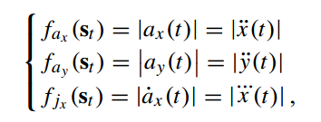
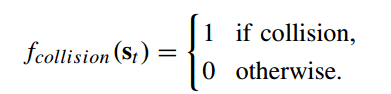

# <center>Attention Based Vehicle Trajectory Prediction</center>

### Related Research

#### Overall Motion Prediction Module

[1] divides the motion prediction problem into three main components:

- **Stimuli (刺激物):** The feature that influence and determine the future intention of the target vehicle are mainly composed of target vehicle cues and environment information
  - **Target vehicle features:** target vehicle past state observations
  - **Environment features:** 
    - Static elements including static obstacles and environment geometry
    - Dynamic elements representing the other traffic participants
- **Modeling Approach:** Different representations of the motion model are used
  - **Physics-based methods:** where the future trajectory is predicted by applying explicit, hand-crafted, physics-based dynamical models.
  - **Pattern-based methods:** that learn the motion and behaviors of vehicles from data of observed trajectories.
  - **Planning-based methods** reason on the motion intent of rational agents.
    - [2] 使用了IRL
    - [3] extend **Generative Adversarial Imitation Learning** (GAIL) and deploy it to predict the driver's future actions given an image and past states.
    - [4] uses a deep imitative model to learn and predict desirable future autonomous
- **Prediction:** Vehicle intent prediction is divided into two main aspects: maneuver and trajectory prediction

#### Deep Learning Pattern-Based Motion Prediction

Motion prediction can be treated as a time series regression or classification problem.

- One of the most important parts in a driver intention prediction model is the surrounding vehicle's interaction extractor. It is also conceived differently in the state of the art.
  - Some existing studies implicitly infer the dependencies between vehicles. They feed a sequence of surrounding vehicles features as inputs to their model. Then, they accord to the LSTM the task of learning the influence of surrounding vehicles on the target vehicle's motion.
  - Other approaches explicitly model the vehicles' interaction

### Target Vehicle Trajectory Prediction

#### Problem Definition

已知：The past tracks and the past tracks of the neighbouring vehicles at observation time $t_{obs}$ of the target vehicle $T$ 

求：To predict the future trajectory of a target vehicle $T$
**Input:** The input tracks of a vehicle $i$ are defined as $\mathrm{X}_{i}=[\mathrm{x}_{i}^1, ..., \mathrm{x}_i^{t_{obs}}]$ where $\mathrm{x}_i^t=(x_i^t, y_i^t, v_i^t, a_i^t, class)$ is the state vector. (**Note:** $\mathrm{X}_{T}$ is the state of the target vehicle $T$. )

使用局部坐标系

**Output:** The parameters characterizing a probability distribution over the predicted position of the target vehicle.

$$\mathrm{Y}_{pred}=[\mathrm{y}_{pred}^{t_{obs}+1},...,\mathrm{y}_{pred}^{t_{obs}+t_f}]$$

where $\mathrm{y}^t=(x^t, y^t)$ is the predicted coordinates of the target vehicle.

#### Overall Model

It is crucial to understand the relationships and interactions that occur on the road to make realistic predictions about vehicle motion.

- *Encoding Layer* where the temporal evolution of the vehicle's trajectories and their motion properties are encoded by an LSTM encoder.
- *Attention module* which links the hidden states of the encoder and decoder.
- *Decoding Layer* 

### Summary

- Method: LSTM encoder + Attention + LSTM Decoder
- Think about interaction
- No information about the road structure

### 参考文献

[1] A. Rudenko, L. Palmieri, M. Herman, K. M. Kitani, D. M. Gavrila, and K. O. Arras, “Human motion trajectory prediction: A survey,” 2019, arXiv:1905.06113.

[2] D. Sierra González, J. S. Dibangoye, and C. Laugier, “High-speed highway scene prediction based on driver models learned from demonstrations,” in Proc. IEEE Int. Conf. Intell. Transp. Syst., Nov. 2016, pp. 149–155.

[3] Y. Li, J. Song, and S. Ermon, “Infogail: Interpretable imitation learning from visual demonstrations,” in Proc. Adv. Neural Inf. Process. Syst. 30, I. Guyon, U.V. Luxburg, S. Bengio, H.Wallach,R. Fergus, S.Vishwanathan, and R. Garnett, Eds. Red Hook, NY, USA: Curran Associates, 2017, pp. 3812–3822.

[4] N. Rhinehart, R. McAllister, and S. Levine, “Deep imitative models for flexible inference, planning, and control,” 2018, arXiv:1810.06544. [Online]. Available: http://arxiv.org/abs/1810.06544

```
@ARTICLE{Messaold2021Journal,
  author={Messaoud, Kaouther and Yahiaoui, Itheri and Verroust-Blondet, Anne and Nashashibi, Fawzi},
  journal={IEEE Transactions on Intelligent Vehicles}, 
  title={Attention Based Vehicle Trajectory Prediction}, 
  year={2021},
  volume={6},
  number={1},
  pages={175-185},
  doi={10.1109/TIV.2020.2991952}}
```


# <center> Deep Inverse Reinforcement Learning for Behavior Prediction in Autonomous Driving</center>

## Introduction

A major hindrance (阻碍) to making accurate future predictions comes from the tradeoffs that humans make between arbitrary complex factors (i.e., their surroundings, the route, behavior, risk, resource, and  goal-oriented factors) when making their own decisions.

Through experience as humans, we have mastered this process over our lifetime, and we seamlessly adapt our behavior. To date, making such predictions autonomously has eluded the machine learning and autonomous driving community.

However, recent developments in areas such as IRL have the potential to address this limitation.


## Behavior Modeling in autonomous driving: A review

In model-based approaches, the factors that inform human behavior are hand engineered and combined to optimize a predefined objective, such as proximity to other vehicles, the number of lane changes, or the risk of taking a particular trajectory.

In learning-based systems, the underlying factors that influence human sociological factors are recovered from the data.

### Model-based learning and supervised learning

Maneuver-dependent trajectory prediction is comparatively more resilient than predicting the trajectory alone [1].

### Generative adversarial imitation learning

Despite their reasonable success, supervised learning approaches cannot recover the underlying factors that influence human social behavior, **as they operate using a predefined cost function** (*也许可以用演化计算自动生成cost function*), which does not fully capture human reasoning [2].

Generative adversarial imitation learning（GAIL), which seeks to directly mimic the expert's policy and has been extensively applied for autonomous driving tasks.

Similar to supervised methods, GAIL does not attempt to recover the reward function. Instead, it attempts to directly mimic the expert's policy. Hence, its applicability to environments with data constraints and its generalizability to new environments remain questionable [3].

### IRL

IRL-based behavior-prediction techniques segregate (分离) the underlying semantics of the scene such that the goal or intent of the agent can be recovered from the model reward function.

This makes the system more tractable and able to generalize to new environments [3] while demonstrating more accurate predictions into the distant future [4], [5].

In [6], the authors first cluster the trajectories in the training set and train a multiclass classifier to label the cluster into a set of finite states. Then they recover the reward matrices $R_i$ for each cluster $i$ using an IRL framework. In the test phase, given an observed partial trajectory, they first predict the cluster identity, and using the recovered reward matrix of that particular cluster and the Viterbi algorithm, they find the most probable sequence of states for its future trajectory.

This linear mapping from features to the reward severely restricts the reward structure that can be modeled [5].

### D-IRL

The recent works of Wulfmeier et al. [7] extent IRL to a deep learning setting, lifting the MaxEnt-IRL constraints and permitting (允许) a nonlinear mapping, which allows more flexibility for the learned reward structure. 

 

## 参考文献

[1] N. Deo and M. M. Trivedi, “Multi-modal trajectory prediction of surrounding vehicles with maneuver based LSTMs,” in Proc. 2018 IEEE Intelligent Vehicles Symp. (IV), pp. 1179–1184. doi: 10.1109/IVS.2018.8500493.

[2] M. Wulfmeier, D. Rao, D. Z. Wang, P. Ondruska, and I. Posner, “Large-scale cost function learning for path planning using deep inverse reinforcement learning,” Int. J. Robot. Res., vol. 36, no. 10, pp. 1073–1087, 2017. doi: 10.1177/0278364917722396.

[3] J. Fu, K. Luo, and S. Levine, “Learning robust rewards with adversarial inverse reinforcement learning,” in Proc. Int. Conf. Learning Representation, (ICLR), 2018, pp. 1–15.

[4] K. Saleh, M. Hossny, and S. Nahavandi, “Long-term recurrent predictive model for intent prediction of pedestrians via inverse reinforcement learning,” in Proc. 2018 Digital Image Computing: Techniques and Applications (DICTA), pp. 1–8. doi: 10.1109/DICTA.2018.8615854.

[5] Y. Zhang, W. Wang, R. Bonatti, D. Maturana, and S. Scherer, “Integrating kinematics and environment context into deep inverse reinforcement learning for predicting off-road vehicle trajectories,” in Proc. Conf. Robot Learning (CoRL), 2018, pp. 1–12.

[6] T. V. Le, S. Liu, and H. C. Lau, “A reinforcement learning framework for trajectory prediction under uncertainty and budget constraint,” in Proc. 22nd European Conf. Artificial Intelligence. Amsterdam, The Netherlands: IOS Press, 2016, pp. 347–354.

[7] M. Wulfmeier, D. Rao, D. Z. Wang, P. Ondruska, and I. Posner, “Large-scale cost function learning for path planning using deep inverse reinforcement learning,” Int. J. Robot. Res., vol. 36, no. 10, pp. 1073–1087, 2017. doi: 10.1177/0278364917722396.

```
@ARTICLE{Fernando2021,
  author={Fernando, Tharindu and Denman, Simon and Sridharan, Sridha and Fookes, Clinton},
  journal={IEEE Signal Processing Magazine}, 
  title={Deep Inverse Reinforcement Learning for Behavior Prediction in Autonomous Driving: Accurate Forecasts of Vehicle Motion}, 
  year={2021},
  volume={38},
  number={1},
  pages={87-96},
  doi={10.1109/MSP.2020.2988287}}
```

# <center>Interaction-Aware Probabilistic Trajectory Prediction of Cut-In Vehicles Using Gaussian Process for Proactive Control of Autonomous Vehicles</center>

## Introduction

In the field of decision-making and control, it is essential to predict the motion of surrounding vehicles in order to evaluate the risk of collision and establish a behavioral plan.


## 参考文献

```
@ARTICLE{Yoon2021,
  author={Yoon, Youngmin and Kim, Changhee and Lee, Jongmin and Yi, Kyongsu},
  journal={IEEE Access}, 
  title={Interaction-Aware Probabilistic Trajectory Prediction of Cut-In Vehicles Using Gaussian Process for Proactive Control of Autonomous Vehicles}, 
  year={2021},
  volume={9},
  number={},
  pages={63440-63455},
  doi={10.1109/ACCESS.2021.3075677}}
```

# <center>Vehicle Trajectory Prediction by Integrating Physics- and Maneuver-Based Approaches Using Interactive Multiple Models</center>

unscented Kalman filters + dynamic Bayesian network

## 参考文献

```
@ARTICLE{Xie2018,
  author={Xie, Guotao and Gao, Hongbo and Qian, Lijun and Huang, Bin and Li, Keqiang and Wang, Jianqiang},
  journal={IEEE Transactions on Industrial Electronics}, 
  title={Vehicle Trajectory Prediction by Integrating Physics- and Maneuver-Based Approaches Using Interactive Multiple Models}, 
  year={2018},
  volume={65},
  number={7},
  pages={5999-6008},
  doi={10.1109/TIE.2017.2782236}}
```

# <center>Driving Behavior Modeling Using Naturalistic Human Driving Data With Inverse Reinforcement Learning</center>

## 数学建模

The state $\mathbf{s}_t \in \mathcal{S}$: the driver observes at timestep $t$ consists of the position, orientations, and velocities of itself and surrounding vehicles

The  action $\mathbf{a}_t \in \mathcal{A}$ the driver takes is composed of speed and steering controls of the ego vehicle.

Assuming a discrete-time setup and a finite length $L$. a trajectory $\zeta=[\mathbf{s}_1, \mathbf{a}_1,\mathbf{s}_2, \mathbf{a}_2,...,\mathbf{s}_L, \mathbf{a}_L]$ is yielded by organizing the state and action in each timestep within the decision horizon.

The trajectory includes multiple vehicles in the driving scene since we consider interactions between agents.

状态$\mathbf{s}_t$只是可以直接从传感器获得的物理或部分观察结果。

我们假设一个基于selected features的加权和的线性结构的reward function

在一个指定的状态$\mathbf{s}_t$的reward function $r(\mathbf{s}_t)$ 被定义为

$$r(\mathbf{s}_t)=\theta^T\mathbf{f}(\mathbf{s}_t) \tag{1}$$

其中，$\mathbf{\theta}=[\theta_1, \theta_2,...,\theta_K]$是$K-$维的权重向量，$\mathbf{f(\mathbf{s}_t)}=[f_1(\mathbf{s}_t), f_2(\mathbf{s}_t),...,f_K(\mathbf{s}_t)]$是提取的刻画状态$\mathbf{s}_t$的feature vector

因此，一条轨迹$R(\zeta)$的reward表示为：

$$\R(\zeta)=\sum_{t}r(\mathbf{s}_t)=\mathbf{\theta}^T\mathbf{f}_{\zeta}=\mathbf{\theta}^T\sum_{\mathbf{s}_t\in \zeta}\mathbf{f}(\mathbf{s}_t)$$

其中，$\mathbf{f}_{\zeta}$表示在轨迹$\zeta$上的accumulative features

### 问题定义

给定一个包含$N$条轨迹的人类驾驶数据$\mathcal{D}=\{\zeta_1, \zeta_2, ..., \zeta_{N}\}$

如何获得reward的权重$\mathbf{\theta}$，使得可以生成一个匹配人类演示轨迹的driving policy


## 轨迹生成

对于横向$y$坐标，我们需要指定目标位置、速度和加速度，与初始状态一起形成总共六个边界条件，这需要一个五次多项式函数。 对于纵向$x$轴，只需要目标速度和加速度，因此四次多项式函数可以满足平滑性要求。

计算五秒的轨迹，每0.1秒作为一个时间间隔

我们可以通过在目标空间$\Phi=\{v_{xe}, a_{xe}, y_{e},v_{ye},a_{ye}\}$采样目标状态从而生成多条多项式轨迹，使得其能够覆盖所有可能的行为。


## 环境模型

1. **车辆的运动学状态根据自行车模型传播。**

**注：**

自行车模型（Bicycle Model）的建立基于如下假设：

- 不考虑车辆在垂直方向（$Z$轴方向）的运动，即假设车辆的运动是一个二维平面上的运动
- 假设车辆左右侧轮胎在任意时刻都拥有相同的转向角度和转速；这样车辆的左右两个轮胎的运动可以合并为一个轮胎来描述
- 假设车辆行驶速度变化缓慢，忽略前后轴载荷的转移
- 假设车身和悬架系统都是刚性系统
- 假设车辆的运动和转向是由前轮驱动的

2. 一般的想法是周围的车辆遵循数据集中的原始轨迹，否则会根据与自车或其他被影响的车辆保持安全距离的目的来做出反应。
3. 基本假设是，人类是反应最好的代理人，他们可以准确地预测其他代理人对其计划行动的反应。 值得注意的是，这种设置可能会在转移函数的估计中引入一些偏差。
4. 具体而言，仅考虑环境中距离本车 50 米范围内的车辆。 周围的车辆首先会按照记录的轨迹来，每个人都会不断检查自己与前方车辆之间的差距。 如果前面是自我车辆并且它们之间的间隙小于 IDM 给出的期望间隙，则环境车辆将被 IDM 覆盖，从而不再遵循其原始轨迹。 同样，如果前面的车辆是被 IDM 覆盖的环境车辆，如果它们之间的间隙太小，后面的环境车辆也会被覆盖。


## Summary of the IRL Algorithm

1. **initialize the reward parameters randomly**
2. **compute the feature expectation of human driving trajectories**
3. **create a buffer to store the feature vector** of all the generated trajectories to avoid sampling in the environment since the sampling process consumes most of the computation time
4. 

## 自然人类驾驶数据集

1. 每辆车的位置以每秒 10 帧的速度记录，从而生成从该区域开始到结束的详细车辆轨迹。 然而，数据集中最初收集的车辆轨迹充满了观察噪声，因此我们使用 **Savitzky-Golay 滤波器**在 2 秒窗口上使用**三阶多项式来平滑原始轨迹**并获得用于奖励学习的演示轨迹。


## 特征选择

1. **Feature are mapping from state to real values which capture important properties of the state.**
2. 驾驶状态的特征从以下四个对人类驾驶员很重要的方面进行归纳：
   - Travel Efficiency:  此功能旨在反映人类尽快到达目的地的愿望，其定义为车辆的速度：
     - $f_{v}(\mathbf{s}_t)=v(t)$
   - Comfort:乘坐舒适度是人类驾驶员更喜欢的另一个因素，衡量舒适度的指标是纵向加速度 $a_x$ 、横向加速度 $a_y$和纵向加加速度 $j_x$ ：
     - 
     - 其中，$x(t)$和$y(t)$是纵向和横向坐标
   - Risk Aversion: 人类驾驶员倾向于与周围的车辆保持安全距离，这个距离因人类驾驶员而异，这反映了他们不同程度的感知风险。 我们将前车的风险水平定义为与从本车到前车的时距相关的指数函数，假设匀速运动：
     - $f_{risk_f}(\mathbf{s}_t)=e^{-(\frac{x_f(t)-x_{ego}(t)}{v_{ego}(t)})}$
     - $f_{risk_r}(\mathbf{s}_t)=e^{-(\frac{x_{ego}(t)-x_r(t)}{v_{r}(t)})}$
       - 其中，$x_r$是自车后面的车的纵坐标，$x_f$是离自车最近的前面的车的纵坐标
     - 请注意，在我们的环境模型中评估生成的轨迹时可能会发生碰撞，包括与其他车辆或路缘石碰撞，因此碰撞也是一个风险指标，其定义为：
       - 
   - Interaction:
     - 人类驾驶行为的一个基本属性是人类意识到他们的行为对周围车辆的影响，或者更具体地说，他们的计划是否会给其他人带来额外的不便（例如，急速减速让行）[32]。 我们引入以下特征来明确表示这种影响。
     - 它被定义为根据我们的环境模型（后面车辆的链式减速反应）受到本车行为影响的环境车辆的预测减速度的总和，表明本车对原路线的改变有 对他们造成直接影响。
     - $f_{I}(\mathbf{s}_t)=\sum_{i}a_i(t), if\ a_i(t)<0$
     - where $a_i(t)$ is the acceleration of the vehicle $i$ that has been influenced by the ego vehicle.
     - 在实际场景中应用奖励函数时，我们可以使用预测模块来估计此特征，该模块使用驱动模型（如 IDM）预测其他agent由于自车计划动作而采取的动作。
3. 上述所有特征都是在每个时间步计算并随着时间的推移累积以获得轨迹的特征。 然后通过除以数据集中的最大值将轨迹特征归一化为 [0, 1]，以抵消其不同单位和尺度的影响。 此外，我们为碰撞特征分配了一个固定的大负权重 (-10)，因为与使该权重可学习相比，这可以提高建模精度。


## 实验设计

1. **Driving Behavior Analysis:** 我们利用所提出的方法来分析不同人类驾驶员的驾驶行为。 我们首先从数据集中展示人类驾驶员的奖励学习过程作为示例，以揭示我们提出的方法的有效性。 然后，学习到的奖励函数用于确定测试条件下候选轨迹的概率并解释一些驾驶行为。
2. **Robustness:** 我们在非训练阶段的场景中测试学习到的奖励函数，以确定学习到的策略与人类策略之间的相似性是否显着下降，以研究所提出方法的鲁棒性。
3. **Model Accuracy:**
   - 我们通过将学到的策略与地面真实的人类驾驶轨迹进行比较，展示了在测试条件下建模准确性的定量结果。
   - 我们研究了个性化的建模假设，即每个人类驾驶员有不同的偏好（驾驶风格），因此对奖励函数有不同的权重。作为比较，我们采用了所有驾驶员共享一个相同的成本函数的一般建模假设。还采用了另外两个基线模型，即分别用于纵向和横向运动的IDM和MOBIL，以及恒速模型。
4. **Interaction Factors:**我们分析了交互因素对建模精度的影响。它们包括奖励函数中的交互功能和在环境模型中模拟周围车辆对自我车辆路线变化的反应。


## 实现细节

1. 为了简化，目标采样空间简化为$\Phi=\{v_{xe}, y_{e}\}$。只包含纵向的速度和横向的位置，其他设置为0
2. 纵向速度的采样区间为：$[v-5, v+5]m/s$ ，以$1m/s$作为间隔，其中，$v$是车辆的初始速度
3. 横向位置的采样集合为$\{y,y_L,y_R\}$，其中，$y$是初始的横向位置，$y_L$和$y_R$分别是左右车道的位置(if they are available)
4. 轨迹的时间跨度是$5s$，并且模拟间隔为$0.1s$
5. IDM模型的参数如下：
   - desired velocity $v_0=v_{current}\ m/s$
   - maximum acceleration $a_{max}=5\ m/s$
   - desired time gap $\tau=1\ s$
   - comfortable braking deceleration $b=3\ m/s$
   - minimum distance $s_0=1\ m$
6. 出现的一个问题是，人类轨迹的纵向和横向抽动与生成的轨迹难以匹配，因为多项式曲线是平滑的，而人类驾驶轨迹充满了噪声运动。因此，我们在给定原始轨迹的初始状态和结束条件的情况下，将人类驾驶轨迹处理成多项式曲线来表示。

## 参考文献

```
@ARTICLE{Huang2021,
  author={Huang, Zhiyu and Wu, Jingda and Lv, Chen},
  journal={IEEE Transactions on Intelligent Transportation Systems}, 
  title={Driving Behavior Modeling Using Naturalistic Human Driving Data With Inverse Reinforcement Learning}, 
  year={2021},
  volume={},
  number={},
  pages={1-13},
  doi={10.1109/TITS.2021.3088935}}
```


# <center>Behavior Prediction in Autonomous Driving</center>

## Introduction

However, current autonomous driving systems do not deal well enough with complex environments filled with human-driven vehicles.

**why ? ** $\Rightarrow$  The main reason is that the current systems are not able to accurately predict the intention or future movement of surrounding vehicles and then negotiate with them.

**How ?** $\Rightarrow$ Ideally, there should be a prediction module in the autonomous driving system architecture.

**Note:** There are two modules in most systems that are related to the understanding and negotiation, i.e., Behavior and Trajectory Planning. 

- The behavior planning module normally outputs high-level commands.
- The trajectory planning the  generate a feasible plan to conduct the command given by the behavior planner.

Unfortunately, most behavior planners are not able to predict human behaviors and negotiate with human drivers, then generate interactive behavior commands. Similarly, in order to generate cooperative trajectories, most of the planning algorithm require an accurate trajectory estimate for other vehicles.

Modeling the influence of these factors on a human driver's behavior is a challenging task.

**交互的复杂性带来的问题以及如何解决：**Due to the complexity of the interaction, it is extremely hard for a single model to handle all cooperative scenarios, such as ramp-merging, lane-changing or intersection traversing.　However, a **universal framework** may be able to serve as a solution for various scenarios, with minor modifications or specific data to fit in.

**这个framework应该是什么样的，或者说应该做些什么？** 

- The core task for such a framework is to formulate the interaction between the host vehicle and other human-driven vehicles.
- The framework bridge the gap between the trajectory planner and higher-level task planner, especially in dynamic environments where the trajectory planner needs other vehicles' future movements as a reference.

**鼓励higher-level planners和trajectory planners之间有冲突**

Because there are differences in the abstraction of input information, the trajectory planners and higher-level planners (such as reference planners and mission planners) can encounter conflicts in the decision making and its execution.

**Behavioral planner没有考虑到lower-level planner的失败，如何解决这个问题？**

- The behavioral planning should consider more detailed information and have the capability to predict environmental changes, e.g., the future trajectories of surrounding vehicles, with bounded uncertainty.
- The behavioral planner should take feedback from the trajectory planner and always prepare to make follow-on decisions.

**需要预测哪些东西？**

To fulfill the requirements for the different levels of decision making and planning, there are three stages of prediction:

- Discrete intentional prediction.
- Semi-continuous prediction
- Continuous prediction


# <center>PiP: Planning-informed Trajectory Prediction for Autonomous Driving</center>


# <center>Learning to Predict Vehicle Trajectories with Model-based Planning</center>

## Problem Formulation

$\mathcal{A}$: on-road agents

$\mathcal{S}$: observed states of on-road agents $\mathcal{A}$

$\mathcal{M}$: HD map

$\mathbf{s}_i^t$: denotes the state $a_i \in \mathcal{A}$ at frame $t$, including position, heading, velocity, turning rate and actor type

$\mathbf{s}_i=\{s_i^{-T_P+1}, s_i^{-T_P+2},...,s_i^0\}$: denotes the state sequence in the observed period $T_P$

#### Question

Given any agent as the prediction target, we denote it by $a_{tar}$ and its surrounding agents by $\mathcal{A_{nbrs}}=\{a_1, a_2,...,a_m\}$ for differentiation, with their state sequence correspondingly given as $s_{tar}$ and $s_{nbrs}=\{s_1, s_2,...,s_m\}$.

$\mathcal{S}=\{s_{tar}\} \cup \mathcal{S}_{nbrs}$ and $\mathcal{A}=\{a_{tar}\} \cup \mathcal{A}_{nbrs}$

#### Objective

To predict multi-modal future tarjectories $\mathcal{T}_{tar}=\{\mathcal{T}_k|k=1,2,...,K\}$ together with corresponding trajectory probability $\{p_k\}$, where $\mathcal{T}_k$ denotes a predicted trajectory for target agent $a_{tar}$ with continuous state information up to the prediction horizon $T_{F}$

$K$ is the number of predicted trajectories.

Additionally, it is required to ensure each prediction $\mathcal{T}_{k}\in \mathcal{T}_{tar}$ is feasible with existing constraints $\mathcal{C}$, which includes environment constraints $\mathcal{C}_{\mathcal{M}}$ and the kinematic constraints $\mathcal{C}_{tar}$.


